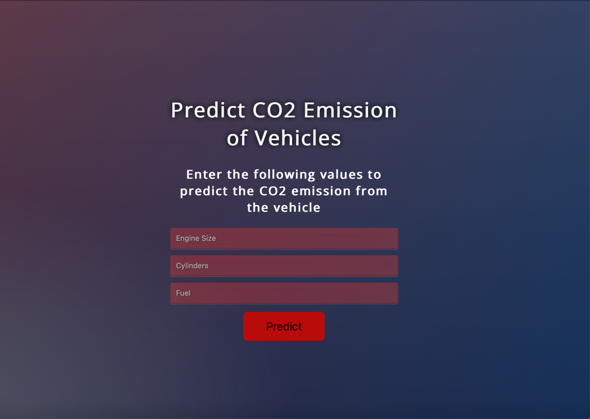

## Using ML to Predict CO2 Emission Among Different Vehicle Models

### Usage
1. Enter "Engine Size", "Cylinders", "Fuel"
2. Click "Predict"
Note: All possible values have not been tested and therefore, you may receive an error message. If you receive an error message, click the 'BACK' button.

### Built With
- Flask
- pandas
- scikit-learn
- pickle
- sklearn
- gunicorn

### Installation
1. Clone the repo: https://github.com/girlCoder8/flask_machine_learning.git

